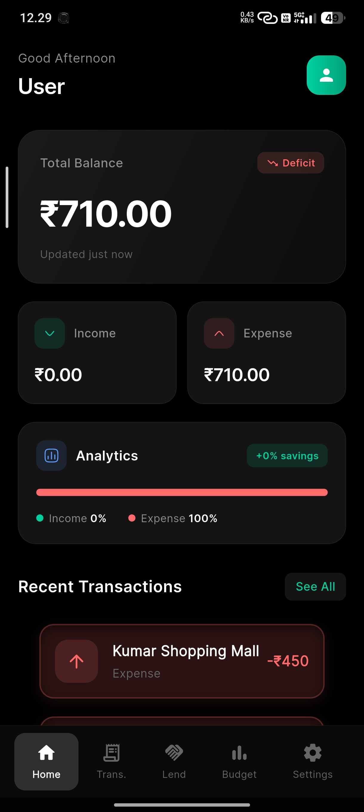
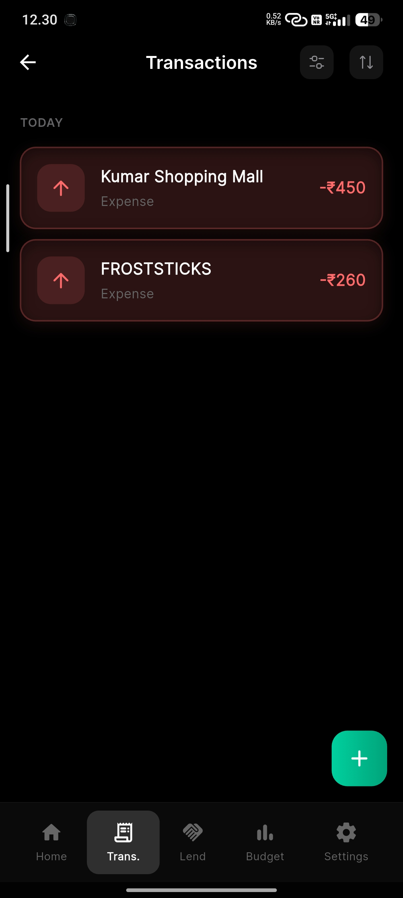
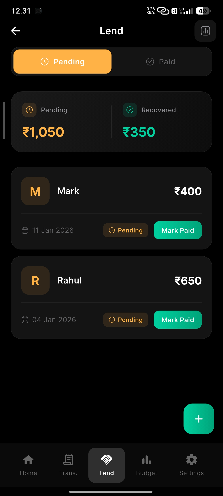
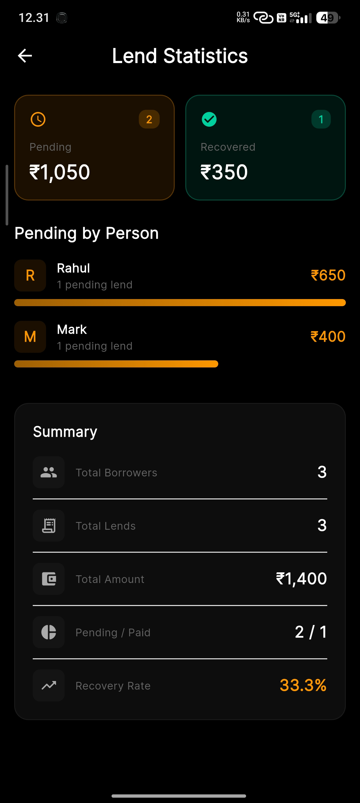
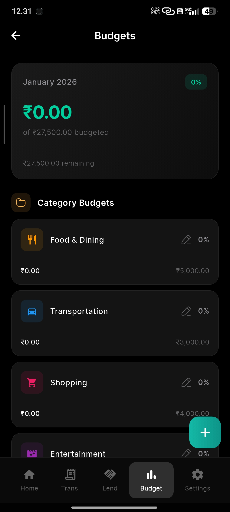
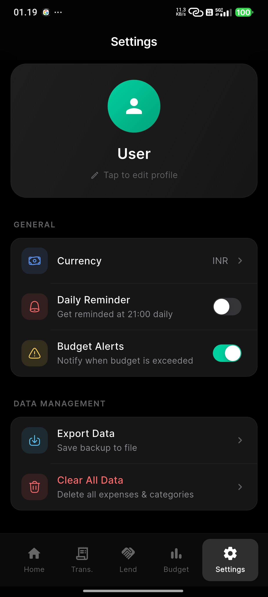

# Rupee 
### The Ultimate Personal Finance Manager

> **Note**: This repository contains the official release builds, documentation, and issue tracker for the Rupee App. The source code is currently closed-source.

---

## 📱 About Rupee
Rupee is a premium, offline-first personal finance application designed to help you track expenses, manage budgets, and oversee lending with ease. Built with a focus on aesthetics and privacy, Rupee offers a stunning **OLED Pure Black** interface that looks beautiful on modern devices while saving battery.

## ✨ Key Features

- **💸 Smart Expense Tracking**  
  Quickly log transactions with intelligent categorization and tagging.

- **📊 Visual Analytics**  
  Gain insights into your spending habits with interactive pie charts and trend lines.

- **🤝 Lend & Borrow Management**  
  Keep track of money lent to friends or borrowed, with "Pending" and "Paid" statuses.

- **🎨 Premium OLED Design**  
  A sleek, minimalist UI with smooth iOS-style animations and focus on content.

- **🔒 Privacy First**  
  Your data belongs to you. Rupee works completely offline and stores data locally/securely.

- **📝 Receipt Scanning**  
  Scan receipts directly into the app (Coming Soon).

## 📥 Download
You can download the latest version of the app from the **[Releases](https://rupee.nynx.in/)** page.

## 🖼️ Screenshots

| Home | Add Expense | Lending |
|:---:|:---:|:---:|
|  |  |  |

| Lending Stats | Budget | Settings |
|:---:|:---:|:---:|
|  |  |  |

## 🐛 Feedback & Support
Found a bug or have a feature request? Please open an issue in the **[Issues](../../issues)** tab.

## 📄 Legal
- **[Privacy Policy](PRIVACY_POLICY.md)**
- **[Terms of Service](TERMS.md)**

---
*© 2026 Rupee App. All rights reserved.*
